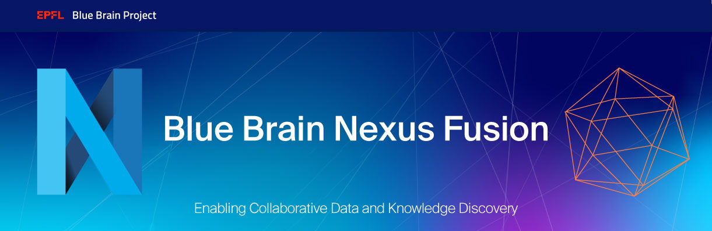

# Nexus Fusion

> Note: expect this repo to be renamed to <https://github.com/BlueBrain/nexus-fusion> to match the new application name and Nexus component branding scheme.

<p align="center">
  
  <a href="https://codecov.io/gh/BlueBrain/nexus-web">
    
  </a>
  <a href="https://twitter.com/intent/follow?screen_name=bluebrainnexus">
    
  </a>
</p>

<p align="center">Nexus Fusion (previously Nexus Web) is the interface of Blue Brain Nexus, the open-source knowledge graph for data-driven science.</p>

<p align="center">
  <a href="https://bluebrainnexus.io/docs/">Blue Brain Nexus Docs</a> |
  <a href="#Development">Development</a> |
  <a href="#studios-feature">Studios</a>
</p>

## Contributing

Learn how we use git [in the wiki](https://github.com/BlueBrain/nexus-web/wiki/Git-Flow)

## Development

Install dependencies:
**Please note you need npm v6.9.0 or above or yarn.**
**Currently, does not work with yarn 2.**

```sh
yarn
```

To start the Nexus in development mode, run:

```sh
yarn start
```

Lint code:

```sh
yarn lint
```

Run unit tests:

```sh
yarn test
```

Run end to end tests:

1. Ensure you have the `cypress.env.json` file locally.
2.

a. To run the tests in headed mode:

```sh
yarn cy:open
```

b. To run the tests in headless mode:

```sh
yarn cy:run
```

## Build for production

Compile app in `dist/` folder.

```sh
yarn build
```

You can run the app with:

```sh
node dist/server.js
```

## Build a Docker image

```sh
docker build . --tag=nexus-web
```

## ENV variables list

- `BASE_PATH`: The base of the app: i.e. `/staging/web` if hosted on `https://bbp-nexus.epfl.ch/staging/web` (default is `/`)
- `HOST_NAME`: name of host where application is available from: i.e. `https://bbp-nexus.epfl.ch` (default is protocol + host where server is running from)
- `CLIENT_ID`: The application name used for _OpenID Connect_ authentication (default is `nexus-web`)
- `API_ENDPOINT`: The URL pointing to Nexus API. Default is '/'
- `SERVICE_ACCOUNTS_REALM`: The realm that is configured for service accounts that should be hidden for Login. Default is 'serviceaccounts'.
- `SECURE`: Is Nexus Fusion running in https or not. Default is `false`
- `GTM_CODE`: The Google Analytics Identifier. GA won't be present unless an ID is specified.
- `SENTRY_DSN`: The sentry URL Nexus Fusion needs to report errors to. Default is undefined.
- `STUDIO_VIEW`: The location of the aggregate elastic search view that contains all the projects: `orgLabel/projectLabel/viewId`
- `LOGO_IMG`: Url for an image to be used as Fusion logo in the Header, for example, `https://drive.boogle.com/jnsjdnsjs`
- `LOGO_LINK`: Url for the logo, for example, `https://www.epfl.ch`
- `FORGE_LINK`: Url for the Forge Templates button, for example, `https://some-url.hi`
- `DATA_MODELS`: The location of the data models to be used in Activity lists in Workflow: `orgLabel/projectLabel`

The following concern Plugins. [See how to manage plugin deployments](./docs/plugins.md)

- `PLUGINS_MANIFEST_PATH`: Remote end point where plugins and manifest can be found. for example, `https://bbp-nexus.epfl.ch/plugins`

## Deployment

You can find out how to deploy a build [in the wiki](https://github.com/BlueBrain/nexus-web/wiki/Deploying-Your-Nexus-Web-Instance)

## Documentation

The documentation for Nexus Fusion can be found in the [product docs](https://bluebrainnexus.io/docs/fusion/index.html).

> Read more about the Fusion [Architecture](https://bluebrainnexus.io/docs/fusion/architecture.html).

### Resource-level [Plugins](https://bluebrainnexus.io/docs/fusion/plugins.html)

A core component of Studio is the ability for data curators to develop a domain-specific presentation layer for their resources in Nexus Fusion. This allows data consumers to visualize their datasets using graphs, charts, or 3D visualizations, and to present the relevant metadata to the user.

Plugins are developed using Javascript and are loaded into the Nexus Fusion instance from the /plugins folder.

### [Studios](https://bluebrainnexus.io/docs/fusion/studio.html) Subapp

Studios space allows data curators to display their data using customisable, persistent queries. Using custom plugins developed with JavaScript, data curators can format the presentation of the query results any way they like.

### [Admin](https://bluebrainnexus.io/docs/fusion/admin.html) Subapp

The Nexus Fusion admin app allows you to manage your Nexus Delta instance.

> Learn how to [Add Your Own App](https://bluebrainnexus.io/docs/fusion/add-your-own-app.html)

## Getting involved

Issue tracking is centralized into [the main Blue Brain Nexus repository](https://github.com/BlueBrain/nexus).

There are several channels provided to address different issues:

- **Feature request**: If there is a feature you would like to see in this application, please first consult the [list of open feature requests](https://github.com/BlueBrain/nexus/issues?q=is%3Aopen+is%3Aissue+label%3Afeature+label%3Afrontend+label%3Anexus-web). In case there isn't already one, please [open a feature request](https://github.com/BlueBrain/nexus/issues/new?labels=feature,frontend,nexus-web) describing your feature with as much detail as possible.
- **Bug report**: If you have found a bug, please create an issue [here](https://github.com/BlueBrain/nexus/issues/new?labels=bug,frontend,nexus-web).

## Development Tips

### When using the nexus sdk

- Never use `@id` as an absolute nexus address.
- avoid using `nexus.httpGet()`, instead, use the specific API methods available

### When building URLs inside the App

- Don't add the basePath in a URL, it will be added automatically by react-router.

## Funding & Acknowledgment

The development of this software was supported by funding to the Blue Brain Project, a research center of the École polytechnique fédérale de Lausanne (EPFL), from the Swiss government's ETH Board of the Swiss Federal Institutes of Technology.

Copyright © 2015-2023 Blue Brain Project/EPFL
