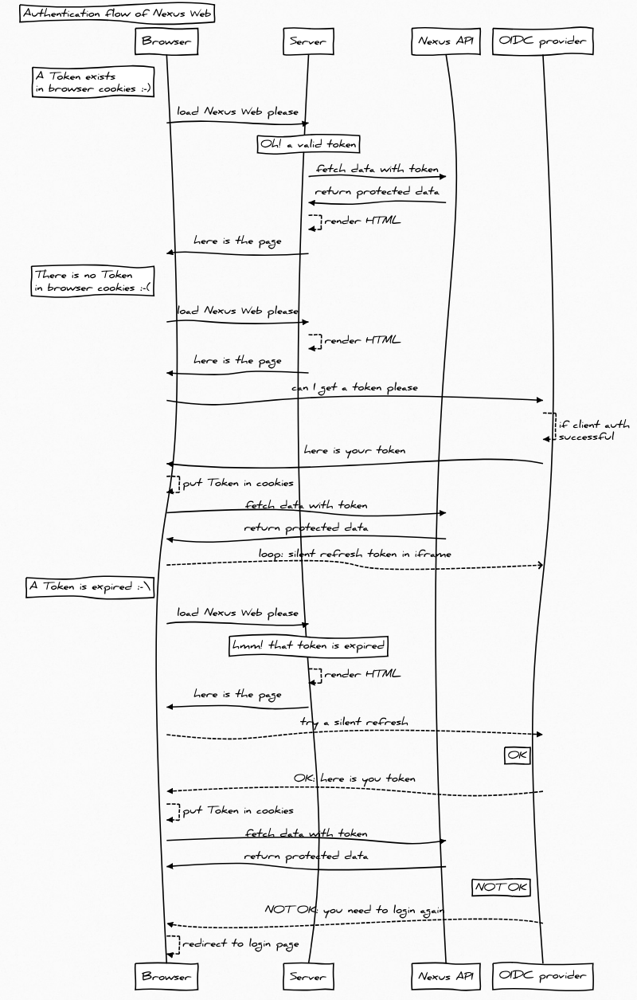

# Authentication in Nexus Web

Nexus Web only supports the [Openid Connect implicit flow](https://openid.net/specs/openid-connect-implicit-1_0.html)

Nexus Web uses serve side rendering technologies, the React/Redux code-base that generates the HTML can run on both the client and the server. In order to get the server to generate the application for an **authenticated** user, we need to pass the client's `Bearer token` to the Nexus Web back-end. That's why we are storing the token in a cookie.

Finally, there are 3 scenarios we can be in, regarding authentication and token:

- no token is present (user has never logged in, or has logged out last time, etc...)
- a valid token is present
- an invalid/expired token is present

Those 3 case are described in the sequence diagram below:

